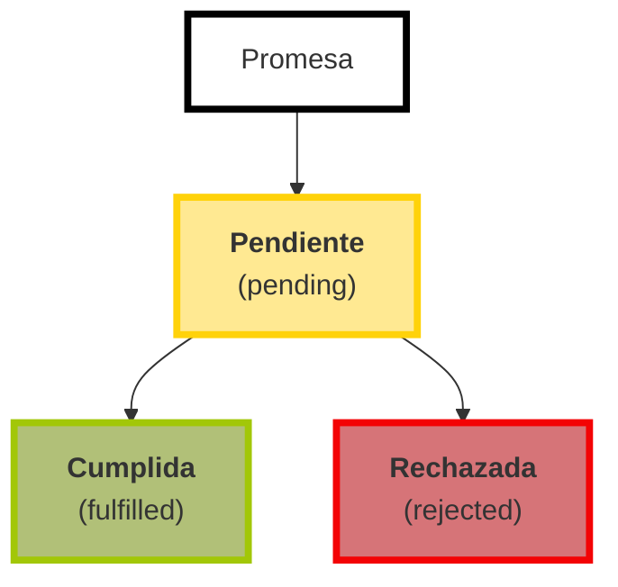

# Node.js 

<section markdown="1">
<aside markdown="1">
## TABLE OF CONTENTS
- [Que es node.js](#queesnode)
- [Caracteristicas](#caracteristicas)
- [Conceptos Importantes](#conceptosimportantes)
- [Ventajas de usar node](#ventajasdeusarnode)
- [¿Que no es node?](#quenoesnode)
- [Instalacion](#instalacion)
- [Modulos](#modulosennodejs)
    * [Importar / Exportar] (#importarexportar)
    * [Destructuracion] (#destructuracion)
    * [Modulos principales] (#modulosprincipalesdenodejs)
- [npm](#npm)
    * [Dependencia](#dependencia)
    * [Crear un paquete](#crearunpaqueteconnpm)
    * [Instalar paquetes externos](#instalarpaquetesexternos)
    * [Desinstalar paquete](#desinstalarpaquete)
    * [Instalar version especifica](#instalarversionespecifica)
    * [devDependencies](#devdependencies)
    * [package-lock.json](#packagelockjson)
- [Eventos](#eventos)
- [Modelo Cliente-Servidor](#modeloclienteservidor)
- [Primer Servidor](#primerservidor)
    * [Modulo HTTP](#modulohttp)
    * [Modulo URL](#modulourl)
- [Routing](#routing)
- [Nodemon](#nodemon)
</aside>

<article markdown="1">
## Que es node?
  

**Entorno de ejecucion** de Javascript orientado a **eventos asincronos**.  

> **Entorno de ejecucion**  
    Entorno (infraestrutura) en el cual se ejecuta un programa o aplicacion.  

> **Evento asincrono**  
    Evento que se ejecuta independientemente del proceso principal de la aplicacion.  

> **Evento sincrono**  
    Evento que se ejecuta como parte del proceso principal de la aplicacion.  


## Caracteristicas
- Open-source
- Multiplaforma
- Basado en el motor V8 de Google Chrome

## Conceptos Importantes
- **Arquitectura cliente-servidor**  
Modelo en el cual el servidor envia recursos al dispositivo que los solicita(cliente)


- **Desarrollo front-end**  
Area del desarrollo web que se encarga del desarrollo de los componentes que ve el usuario y con los cuales interactua

- **Desarrollo back-end**  
Area del desarrollo web que se encarga del desarrollo de los servidores y las bases de datos.

Cuando el navegador se comunica con el servidor, no necesariamente esos mensajes van estar en un formato que ambos entiendan.Como cuando hablamos con otra persona de otros pais.  
¿Como se logra la comunicacion? a travez de **protocolos**.

> **Protocolo**
Reglas que permiten que dos entidades de una red se comuniquen
    Procolo HTTP - HTTPS

**API**  
**A**pplication **P**rogramming **I**nterface  
Interfaz de programacion de aplicaciones


Es como un tipo de intermediario entre distintos programas.


[Mas info SPA](https://juanda.gitbooks.io/phonegap/content/spa/arquitectura_de_un_spa.html)  

## Ventajas de usar node  
Nos permite desarrollar aplicaciones **escalables** y de **tiempo real**.

> **Escalable**.  
Su rendimiento se puede adaptar a medida que crece el uso de la aplicacion y recibe mas solicitudes.

> **Aplicacion de tiempo real**.  
Establece una conexion bidireccional y dinamica entre el servidor y el cliente. Analiza los enventos que ocurren y reacciona de forma casi inmediata.

## ¿Que no es node?
- lenguaje de programacion
- framework
- libreria (biblioteca)

## Instalacion

[Pagina oficial](https://nodejs.org/en)

- comprobar instalacion:  
`node --version`

- primer programa en node:  
`node app.js`


## Modulos en Node.js
Funcionalidad organizada en uno o varias archivos Javascript que puede ser reutilizada en un aplicacion.

### Importar / Exportar

#### CommonJS modules
Los **módulos CommonJS** es un standar de uso para implementar modulos en JavaScript del lado del servidor y forma default de trabajar con modulos en Node.js. Node.js también es compatible con el estándar de **módulos ECMAScript** que utilizan los navegadores.

- Exportar  
```js
//saludo.js
function saludar(nombre) {
    return `Hola, ${nombre}`;
}

function holaMundo() {
    console.log('Hola mundo');
}

// Modo 1
module.exports.saludar = saludar;
module.exports.holaMundo = holaMundo;

// Modo 2
module.exports = {
    saludar: saludar,
    holaMundo: holaMundo
}

// Modo 3
module.exports = {
    saludar,
    holaMundo
}
```

-Importar (un modulo)
Darle accesos a funciones y elementos definidos en otro modulo.  

```
// app.js
const saludo = require('./saludo')

console.log(saludo.saludar('Adrian'))
```
[Documentacion CommonJs](https://nodejs.org/docs/latest-v18.x/api/modules.html)

### Destructuracion
Es una expresion en javascript que permite extraer los valores de arreglos y objectos en variables.

Podemos usarlo al momento de importar modulos.

```
const { saludar, saludarHolaMundo} = require('./saludo');
```  

[Documentacion destructuracion](https://developer.mozilla.org/es/docs/Web/JavaScript/Reference/Operators/Destructuring_assignment)

### Modulos principales de node js
**Modulo built in (core)**
son modulos que ya viene con node y puedes usar sin instalar.
Utiles para realizar comunes
Modulos:
* http
* https
* fs (file system)
* os (operating system)
* path

#### Modulo console
implementa la funcionalidad similar a la consola del navegador

```
console.log("Hola")
console.warn("advertencia");
console.error("Ocurrio un error");
console.error(new Error("Ocurrio un error!"));
```

#### Modulo process
Provee info sobre el proceso donde node se esta ejecutando

```
console.log(process)
console.log(process.env)

console.log(process.argv);
```

#### Modulo OS (operating system)
```
const os = require('os');

console.log(os.type())
console.log(os.homedir()) //directiorio principal

console.log(os.uptime())  //tiempo que lleva encendido el os
console.log(os.userInfo())
```
#### Modulo timers (Temporizador)
Contiene funciones que ejecutan codigo luego de cierto periodo.

```
setTimeout(funcion, milisegundos, argumentos)
// Ejecuta el codigo despues de un numero de milisegundos, 1 seg = 1000 milisegundos  
```  

```
setInterval(function, intervalo, argumentos)
// Ejecuta el codigo infinitamente con un tiempo de espera en milisegundos 
```  

```
setInmediate(funcion, argumentos)
Ejecuta codigo asincrono en la proxima iteracion del ciclo de eventos (lo mas pronto posible)  
```  

#### Modulo fs
File System  
Contiene funciones para trabajar con el sistema de archivos  
Operacion utiles sobre un archivo:  
* leer
* modificar
* copiar
* eliminar
* cambiar nombre

Todos los metodos son asincronos por defecto. No bloquear la ejecucion del programa.
Pero puedes escoger versiones sincronas de estos metodos (sync)  
```
// funcion asincrona
fs.rename()

// funcion sincrona
fs.renameSync()
```
Ejemplos: 
```js
// Leer archivo
fs.readFile("index.html", 'utf-8', (err, contenido) => {
    if(err)
        throw err; //Lanza (genera) un error
    console.log(contenido);
})

// Eliminar archivo
fs.unlink('main.html', (err) => {
    if(err)
        throw err;
    console.log('Archivo eliminado');
})

//Remplazar todo el contenido del archivo
fs.watchFile('index.html', '<p>hola</p>', (err) => {
    if(err)
        throw err;
    console.log('Contenido remplazado existosamente');
})
```
## NPM
Es el gestor de paquetes mas grande del mundo para node. Tambien es una herramienta para linea de comandos.  

> **Paquete**  
  Archivo o directorio descrito por un archivo package.json.
[npm](https://www.npmjs.com/)  


> **Modulo**  
  Cualquier archivo js o directorio dentro de la carpeta node_modules que puede ser importado con require().  
La carpeta debe tener un **package.json** con la propiedad **main**.  
Solo los modulos que tienen un archivo package.json son paquetes.

### Dependecia
Paquete que otro paquete necesita para funcionar.  

### Crear un paquete con npm
```shell
npm init
npm init --yes // Crea package.json con valores por defecto
```

### Instalar paquetes externos
1. Buscar el paquete en google: npm express
2.  `npm install express | npm i express
    `   

El paquete lo podemos encontrar en el archivo **package.json** en la propiedad **dependencies**

### Desinstalar paquete
`npm uninstall express`

### Instalar version especifica
`npm install express@4.15.1`

> Normalmente no se comparte la carpeta node_modules, el archivo package.json permite instalar todos los paquetes que sean usado, con el comando `npm install`.  

### devDependencies
Algunas dependencias solo las vamos usar mientras estemos desarrollando la aplicacion, no se necesitan para cuando la aplicacion este funcionando en un entorno de produccion.  
¿Como se instalan?  
`npm install express --save-dev`  
`npm install express -D`  

### package-lock.json
Se genera cuando npm modifica el arbol de node_modules o package.json  
Describe el arbol generado para que en futuras instalaciones puedan generar exactamente el mismo arbol.  
De esta forma otros desarrolladores pueden instalar exactamente las mismas dependencias.

## Eventos
Una accion que se realiza en la aplicacion.  

### Emitters (emisores)
Objetos que emiten eventos nombrados y llaman a funciones especificas. Son instancias de **EventEmitter**.  Esos objetos tienen el metodo **.on()** para asociar una funcion al evento.
y cuando se ejecuta la funcion se le denomina **EventHandler**.  

### Modulo Events
nos permite:  
- Definir
- Emitir
- Escuchar  

`Ex: 8` 
```
const EventEmitter = require('events');

const emisorProductos = new EventEmitter();

emisorProductos.on('compra', (total) => {
    console.log('Se realizo una compra por $${total}');
});

emisorProductos.emit('compra', 500);
``` 

#### Promesas
Objeto que representa el eventual resultado (o error) de una operacion asincrona.


Ese objecto se asocia a una callback function.  
**Funcion callback** es una funcion que se pasa a otra funcion como argumento y luego se ejecuta dentro de la funcion externa.  
Las promesas tienen un metodo **.then()**, con el que podemos decidir que ocurre cuando se completa la promesa (exito o error);  
`Ex 9`  
```javascript
const promesaCumplida = true;

const miPromesa = new Promise((resolve, reject) => {
    setTimeout(()=> {
        if (promesaCumplida) {
            resolve('Promesa cumplida')
        } else {
            reject('Promesa rechazada')
        }
    }, 3000)
});

const manejarPromesaCumplida = (valor) => {
    console.log(valor);
};

const manejarPromesaRechazada = (razonRechazo) => {
    console.log(razonRechazo);
};

miPromesa.then(manejarPromesaCumplida, manejarPromesaRechazada)
```
**.catch()**  
Metodo que se ejecuta si la promesa es rechazada.  

**Encadenar promesas y async await**  
`Ex 10`  
```js
// Imaginemos estamos en una tienda y queremos comprar un producto
// Como no sabemos cuando tiempo tome el ordenar el producto creamos una promesa

function ordernarProducto(producto) {
    return new Promise((resolve, reject) => {
        console.log(`Ordenando: ${producto}`);
        setTimeout(() => {
            if(producto === 'taza') resolve('Taza ordenada');
            else reject('Producto no disponible');
        }, 2000);
    })
}

function procesarPedido(respuesta) {
    return new Promise((resolve) => {
        console.log('Procesando respuesta...');
        setTimeout(() => {
            resolve('Gracias por tu compra. Disfruta tu producto.')
        }, 4000);
    });
}


// ordernarProducto('taza')
// .then(respuesta => {
//     console.log('Respuesta recibida:');
//     console.log(respuesta);
//     return procesarPedido(respuesta);
// })
// .then(respuestaProcesada => {
//     console.log(respuestaProcesada);
// })
// .catch(error => {
//     console.log(error);
// })

// Si necesitamos encadenar mas procesos esto seria mas dificil de entender
// la alternativa es async await

// async indica que esta funcion va procesar codigo asyncrono
async function realizarPedido(producto) {
    try {
        const respuesta = await ordernarProducto(producto);
        console.log('Respuesta recibida');
        console.log(respuesta);
        const respuestaProcesada = await procesarPedido(respuesta);
        console.log(respuestaProcesada);
    } catch(error) {
        console.log(error);
    }

}

realizarPedido('taza');
```

## Modelo cliente-servidor

**Cliente**  
El navegador desde el cual se relizan solicitudes a un servidor.

**Servidor**
Programa que se ejecuta en un servidor fisico para ofrecer un servicio al cliente. Envia informacion.  

Tanto el cliente como el servidor conocen el formato que reciben del otro.  
El **protocolo HTTP** define el formato de los mensajes.  

**protocolo**  
Conjunto de reglas que permiten transmitir informacion entre dispositivos de una red.  

### Solicitudes HTTP
Cuando un cliente le pide informacion a un servidor o desencadena un evento en el servidor para realizar un proceso, esta relizando un **request**.

> Request = Solicitud

Solicitud http (request) tiene todos estos elementos:
- Metodos HTTP
- Camino (path)
- Version de http
- Cabeceras (headers)
- Cuerpo (body)

**Headers**
Proveen informacion adicional sobre la solicitud.  

**Metodo HTTP**  
**Verbo o sustantivo**, indica la intencionde la solicitud.
- GET
- POST
- PUT 
- DELETE

**GET**  
Verbo para solicitud un recurso especifico. Por ejemplo un archivo, HTML o una imagen.  
**POST**
Crear un recurso especifico. Ej: Agregar un usuario nuevo a la base de datos.  
**PUT**  
Modificar un recurso especifico. Ej: Hacer un cambio en la bd.  
**DELETE**
Eliminar un recurso.  

**Body**  
Contienen la informacion enviada a procesar en el servidor.  
No se incluye en todas las solicitudes, solo en POST, PUT.

### Respuestas HTTP
Una vez que el cliente envia su solicitud, el servidor la procesa y le envia al que llamamos Response (respuesta).  
Contiene:
- Codigo de estado
- Texto de estado
- Version de http
- Cabeceras (headers)
- Cuerpo (body)

**body**  
Contiene la **informacion** que debe ser enviada desde el servidor hacia el cliente.  

**Codigos de estado de respuesta**  
Es un numero que indica si se ha completado exitosamente, o no, la solicitud http.  
- Respuestas infomartivas (100-199)
- Respuestas satisfactorias (200-299)
- Redirecciones (300-399)
- Errores de los clientes (400-499)
- Errores de los servidores (500-599)

[Documentacion Codigos de estados](https://developer.mozilla.org/es/docs/Web/HTTP/Status)

**Mas comunes**  
- **200 OK**, La respuesta fue exitosa.
- **400 Bad Request**, El servidor no pudo interpretar la solicitud.
- **404 Not Found**, El servidor no pudo encontrar el recurso solicitado.
- **500 Internal Server Error**, El servidor se encontro con una situacion que no sabe como manejar.  

## Primer servidor
### Modulo http

Este modulo permite transmitir informacion con el protocolo HTTP.

Cuando iniciemos el servidor, estara a la escucha de las solicitudes del cliente y para eso necesitamos un puerto.

**puerto**  
Ubicacion virtual del sistema operativo, en el cual se puede acceder una aplicacion o proceso especifico que se este ejecutando en ese puerto.
 
`Ex 11` 
```js
const http = require('http');

// Cada vez que reciba una solicitud va ejecuta la funcion que le pasemos como argumento
const servidor = http.createServer((req, res) => {
    console.log('Solicitud nueva');
    res.end('Hola mundo');
    //Enviamos la respuesta al cliente
})

// puerto, y funcion para definir que va ocurrir cuando el servidor comienze a ejecutarse
const puerto = 3000;
servidor.listen(puerto, () => {
    console.log(`El servidor esta escuchando en el puerto ${puerto}`)
});
```

Consulta de url, metodo, headers y cambio de codigo de estado
```
const servidor = http.createServer((req, res) => {
    console.log('===> request (solicitud)');
    console.log(req.url);
    console.log(req.method);
    console.log(req.headers);

    console.log('===> response (respuesta)');
    console.log(req.statusCode);
    req.statusCode = 404;
    req.setHeader('content-type', 'application/json');
    console.log(req.getHeaders());
    res.end('Hola mundo');
})
```


#### Estructura de una url
**URL**  
Direccion de un recurso en la web  

**https://www.tecsanpedro.edu.mx/sistemas**


| Definicion  | Parte URL |
| -------- | ------ |
| protocolo | https://  |
| subdominio | www |
| dominio | tecsanpedro |
| dominio de nivel superior |edu.mx |
| camino (path) | sistemas |


**subdominio**  
Informacion adicional agregada al inicio del dominio.  
Permite organizar y separar la informacion para distintos propositos.

**dominio**  
Refencia unica a un sitio web en internet.

**camino (path)**  
Archivo o directorio en el servidor web. Puede tener parametros para personlizarlos y forman parte de la URL. Ej: /usuarios/14

**parametros query**  
https://www.fedex.com/fedextrack/**?trknbr=396940489134**  
Son usados para obtener contenido dinamico, por ejemplo, filtrar una lista de datos. Se definen por medio de una clave - valor. Podemos definir varios parametros, separandolos por el simbolo **&**  

google.com/search?q=mermaid&sclient=gws-wiz  

Usualmente usamos estos parametros, para filtrar en las solicitudes **GET** (para obtener recursos especificos)

### Modulo URL

`Ex 12`
```
const miURL = new URL('https://www.udemy.com/topic/ethical-hacking/?price=price-free&sort=popularity');

console.log(miURL.hostname) // www.udemy.com
console.log(miURL.pathname); // /topic/ethical-hacking/
console.log(miURL.searchParams); 
console.log(miURL.searchParams.get('price')); 
console.log(miURL.searchParams.get('sort')); 

console.log(miURL.protocol);
```

## Routing

Manejar las solicitudes del cliente en base a ciertos criterios.

Route = Ruta  

Criterios para la ruta:
- Metodo (Get, post, ...)
- Path

[JSON Formatter](https://chrome.google.com/webstore/search/json)  

`Ex 13 - Routing`  

cursos.js
```js
let infoCursos = {
    'programacion': [
        {
            id: 1,
            titulo: 'Aprende python',
            lenguaje: 'python',
            vistas: 15000,
            nivel: 'basico'
        }, 
        {
            id: 2,
            titulo: 'Python intermedio',
            lenguaje: 'python',
            vistas: 13553,
            nivel: 'intermedio'
        }, 
        {
            id: 3,
            titulo: 'Aprende JavaScript',
            lenguaje: 'javascript',
            vistas: 10200,
            nivel: 'basico'
        }, 
    ],
    'edicion': [
        {
            id: 1,
            titulo: 'Aprende photoshop',
            tema: 'fotografia',
            vistas: 15000,
            nivel: 'basico'
        }, 
        {
            id: 2,
            titulo: 'Photoshop avanzado',
            tema: 'fotografia',
            vistas: 10221,
            nivel: 'intermedio'
        }, 
    ]
}

module.exports.infoCursos = infoCursos;
```  
app.js
```js
const http = require("http");
const cursos = require("./cursos");

const servidor = http.createServer((req, res) => {
  const {method} = req;

  switch(method) {
    case 'GET':
      return manejarSolicitudGET(req, res);
    case 'POST':
      return manejarSolicitudPOST(req, res);
    default:
      res.statusCode = 501;
      res.end(`El metodo no puede ser manejado por el servidor: ${method}`)
  }
});

function manejarSolicitudGET(req, res) {
  const path = req.url;

  if(path === '/') {
    res.statusCode = 200;
    return res.end('Bienvenidos a primer servidor y api con node js')
  } else if (path === '/cursos') {
    res.statusCode = 200;
    return res.end(JSON.stringify(cursos.infoCursos))
  } else if (path === '/cursos/programacion') {
    res.statusCode = 200;
    return res.end(JSON.stringify(cursos.infoCursos.programacion))
  }

  res.statusCode = 404;
  res.end('El recursos solicitado no existe')
}

function manejarSolicitudPOST(req, res) {
  const path = req.url;

  if(path === '/cursos/programacion') {
    let cuerpo = '';

    req.on('data', contenido => {
      cuerpo += contenido.toString();
    })

    req.on('end', () => {
      console.log(cuerpo)
      cuerpo = JSON.parse(cuerpo);

      console.log(cuerpo.titulo)
      return res.end('El servidor recibio una solicitud POST para /cursos/programacion');
    })
  }
}

const puerto = 3000;
servidor.listen(puerto, () => {
  console.log(`El servidor esta escuchando en el puerto ${puerto}`);
});
```
### Nodemon
Herramienta que reinicia la aplicacion de nodejs cuando detecta algun cambio en los archivos.  

Instalacion  
```
npm install -g nodemon
```  
Se recomienda instalarlo de manera global para que este disponible el cualquier lado, y no solo para un proyecto especifico.  

Ejecutarlo:  
```
nodemon app.js
```  
</article>
</section>